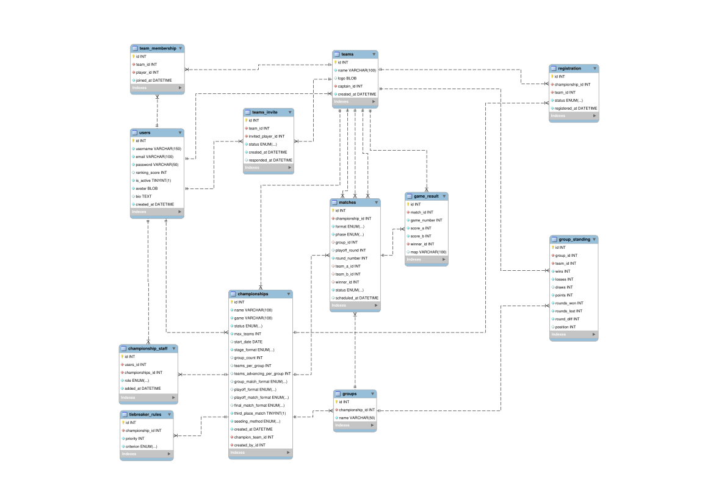

# GameChamp

Sistema web para gerenciamento de campeonatos de jogos competitivos desenvolvido com Django.

O projeto permite criar campeonatos personalizados, gerenciar equipes, controlar inscrições, organizar partidas e acompanhar resultados de torneios em diferentes formatos.

---

# Funcionalidades

## Autenticação e Usuários

* Cadastro e login de usuários
* Perfil de jogador com avatar e bio
* Sistema de permissões com Django Admin
* Controle de usuários ativos

---

## Gerenciamento de Equipes

* Criação de equipes
* Capitão definido automaticamente ao criar equipe
* Edição de nome e logo
* Apenas o capitão da equipe pode convidar jogadores para a equipe
* Aceitar ou recusar convites
* Remoção de membros
* Transferência de capitania

### Sistema de Convites

Os convites são controlados por uma entidade própria (`TeamInvite`), permitindo:

* Status do convite (`pending`, `accepted`, `declined`)
* Registro de criação do convite
* Registro da resposta do jogador
* Controle de convites pendentes

---

## Campeonatos

* Criação de campeonatos personalizados
* Controle de inscrições
* Aprovação ou rejeição de equipes
* Configuração completa do formato do torneio
* Definição automática de chaveamento
* Registro de resultados
* Encerramento do campeonato com definição do campeão

### Formatos Suportados

* Eliminação simples
* Eliminação dupla
* Round-robin
* Grupos + playoffs

### Formatos de Partida

* MD1
* MD3
* MD5

---

## Sistema de Staff

Cada campeonato possui um sistema de staff próprio:

* Owner
* Moderator

A relação é controlada pela entidade `ChampionshipStaff`, permitindo múltiplos administradores por campeonato.

---

## Partidas e Resultados

* Partidas por fase
* Controle de rounds/playoffs
* Registro individual de mapas/games
* Cálculo automático do vencedor
* Avanço automático no bracket

---

## Fase de Grupos

* Classificação automática
* Controle de:

  * vitórias
  * derrotas
  * empates
  * pontos
  * rounds ganhos/perdidos
  * saldo de rounds

### Critérios de Desempate

Critérios configuráveis por prioridade:

* Pontos
* Vitórias
* Confronto direto
* Saldo de rounds
* Rounds ganhos
* Win rate

---

# Tecnologias Utilizadas

## Backend

* Python
* Django
* Django ORM

## Frontend

* Django Templates
* HTML
* CSS
* JavaScript

## Banco de Dados

* Modelagem relacional
* Relacionamentos N:N com entidades intermediárias
* Constraints de integridade
* Foreign Keys
* Índices únicos

---

# Estrutura do Banco de Dados

O sistema utiliza uma modelagem relacional baseada em entidades intermediárias para representar relacionamentos com informações extras.

Exemplos:

| Relação                         | Entidade Intermediária |
| ------------------------------- | ---------------------- |
| Usuários ↔ Equipes              | `TeamMembership`       |
| Equipes ↔ Convites              | `TeamInvite`           |
| Equipes ↔ Campeonatos           | `Registration`         |
| Usuários ↔ Staff de Campeonatos | `ChampionshipStaff`    |

---

# Diagrama do Banco de Dados



---

# Principais Entidades

| Entidade            | Descrição                            |
| ------------------- | ------------------------------------ |
| `User`              | Usuários da plataforma               |
| `Team`              | Equipes criadas pelos jogadores      |
| `TeamMembership`    | Relação entre usuários e equipes     |
| `TeamInvite`        | Convites enviados para jogadores     |
| `Championship`      | Campeonatos                          |
| `Registration`      | Inscrições de equipes                |
| `ChampionshipStaff` | Staff administrativa dos campeonatos |
| `Match`             | Partidas do torneio                  |
| `GameResult`        | Resultado individual dos games       |
| `Group`             | Grupos do campeonato                 |
| `GroupStanding`     | Classificação dos grupos             |
| `TiebreakerRule`    | Critérios de desempate               |

---

# Relacionamentos Principais

| Relacionamento        | Tipo                        |
| --------------------- | --------------------------- |
| User ↔ Team           | N:N via `TeamMembership`    |
| Team ↔ User           | N:N via `TeamInvite`        |
| Team ↔ Championship   | N:N via `Registration`      |
| User ↔ Championship   | N:N via `ChampionshipStaff` |
| Championship → Match  | 1:N                         |
| Match → GameResult    | 1:N                         |
| Championship → Group  | 1:N                         |
| Group → GroupStanding | 1:N                         |

---

# Estrutura do Projeto

```bash
.
├── apps
│   ├── accounts
│   ├── championships
│   ├── matches
│   └── teams
├── config
├── media
│   ├── avatars
│   └── team_logos
├── static
│   ├── css
│   ├── img
│   └── js
├── templates
│   ├── accounts
│   ├── championships
│   ├── matches
│   └── teams
├── manage.py
├── requirements.txt
├── README.md
└── EER_Diagram.svg
```

## Organização dos Apps

| App             | Responsabilidade                      |
| --------------- | ------------------------------------- |
| `accounts`      | Autenticação e usuários               |
| `teams`         | Equipes, membros e convites           |
| `championships` | Campeonatos e regras                  |
| `matches`       | Partidas, classificações e resultados |

---

# Como Executar o Projeto

## 1. Clonar o repositório

```bash
git clone <repo>
cd gamechamp
```

## 2. Criar ambiente virtual

```bash
python -m venv venv
```

## 3. Ativar ambiente virtual

### Linux

```bash
source venv/bin/activate
```

### Windows

```bash
venv\Scripts\activate
```

---

## 4. Instalar dependências

```bash
pip install -r requirements.txt
```

---

## 5. Executar migrações

```bash
python manage.py migrate
```

---

## 6. Criar superusuário

```bash
python manage.py createsuperuser
```

---

## 7. Iniciar servidor

```bash
python manage.py runserver
```

---

# Autores

Gabriel Jardim de Souza
Kauê de Oliveira Silva
Thiago Ferreira Azevedo
